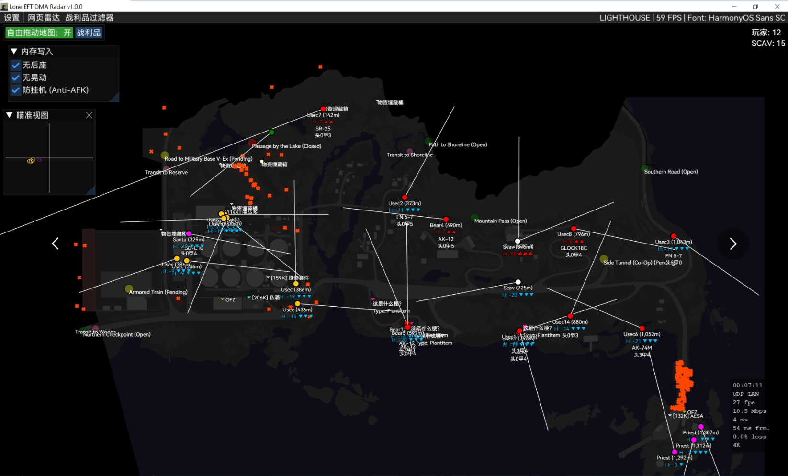

# Lone EFT DMA Radar（汉化版）

这是基于上游项目的**中文汉化版本**（UI 文本与运行时翻译文件）。

- 上游原项目：<https://github.com/lone-dma/Lone-EFT-DMA-Radar>
- 本分支目标：在尽量不改动上游逻辑的前提下，完成汉化并做少量实用改进。

## ① 汉化（翻译）
- **运行时本地化（可编辑 JSON）**：引入 `Loc.T/Loc.WithId/Loc.Title`，把大量 UI 硬编码文本替换为可翻译 key。
- **默认中文（新机器首次启动即中文）**：内置中文翻译资源，首次启动自动生成并加载 `%AppData%\Lone-EFT-DMA\lang\zh-CN.json`。
- **语言切换（无需重启）**：`Settings → General → Language` 支持 English/Chinese，切换后 UI 文本即时生效。
- **物品/任务/地图等名称随语言变化**：对接 `tarkov.dev` GraphQL 的 `lang` 参数，按语言缓存数据，避免中英文互相覆盖。
- **地图文字支持中文**：地图渲染使用 SkiaSharp，中文界面下优先选择系统中文字体（如微软雅黑）作为字体回退。
- **字体升级**：
  - 内置 **HarmonyOS Sans** 字体，提供更清晰、现代的无衬线视觉体验。
  - 完美支持中文显示，开启次像素抗锯齿。
  - 自动回退机制：HarmonyOS Sans -> 微软雅黑 UI -> Segoe UI -> Arial。

## ② 我做的改进（非翻译）
- **内存写入功能 (Memory Writing)**：
  - **独立面板**：新增独立的“内存写入”面板（不可关闭，仅可折叠），方便快速开关。
  - **无后座 (No Recoil)**：移除武器射击后座力。
  - **无晃动 (No Sway)**：移除瞄准时的呼吸晃动。
  - **防挂机 (Anti-AFK)**：防止因长时间无操作被踢出游戏（已移至此面板）。
  - *功能实现参考自：[Kostya12rus/EFT-DMA-Radar](https://github.com/Kostya12rus/EFT-DMA-Radar)*
- **防弹等级显示 (Armor Class)**：
  - **物品标签**：在地面物品标签中显示防弹等级（如 `[AC4]`）。
  - **玩家标签**：在 PMC/Boss 玩家标签下方显示头盔和护甲等级（如 `头3甲4`），智能判断弹挂甲等级。
- **UI 修复与优化**：
  - 修复左上角覆盖层按钮在 UI 缩放时被遮挡的问题。
  - 汉化了雷达状态提示文字（如 "Game Process Not Running"）。
- **地图显示目标手持物品（可开关）**：在玩家标签中显示 `In Hands`（手持物品名），并做排版合并避免与高度/距离信息重叠。
- **地图信息排版优化**：距离改为 `Name (120m)` 的形式，去掉冗余 `D:`；同时将朝向/指向线条调细。
- **UI 风格扁平化**：
  - **实心图标**：玩家/AI 图标由空心圆改为实心圆，视觉更扎实。
  - **尺寸调整**：大幅缩小玩家图标尺寸（50%），减少地图拥挤感。
  - **纯白文字**：强制地图和列表中的所有文字显示为白色，去除杂乱的阵营颜色干扰，仅保留图标颜色区分阵营。
- **撤离点与转点优化**：
  - **转点 (Transits)**：显示为粉色小圆点，文字常驻下方。
  - **撤离点 (Exfils)**：统一为圆形图标，根据状态变色（绿=开，黄=待定，红=关）。
  - 移除了高低差箭头指示，保持界面整洁。
- **逻辑修复**：
  - 修复了 Exfil 状态读取逻辑，现在能正确显示撤离点开启状态。
  - 修复了内存读取相关的编译错误。
- **地图渲染分层优化**：将玩家指示点（圆圈）绘制在文字层之上，防止指示点被密集文字遮挡。
- **撤离点匹配修复**：修复了中文环境下撤离点状态无法更新的问题（强制撤离点名称使用英文源数据进行匹配）。
- **撤离点状态逻辑修复**：修复了 `Postponed` 状态导致的显示错误。
- **名称显示优化**：修复了部分撤离点名称包含多余空格导致匹配失败的问题。
- **地图旋转**：新增地图旋转功能（支持90°/180°/270°），并修复了旋转后玩家朝向、瞄准线及坐标系转换不正确的问题。
- **连线显示**：新增本地玩家与队友之间的连线绘制功能。
- **图层调整**：调整绘制顺序，将玩家（PMC/Scav等）置于最顶层显示，避免被物资遮挡。
- **撤离点优化**：降低撤离点图标填充透明度，增加黑色细描边；调试模式下在地图上直接显示撤离点状态（Open/Pending/Closed）。
- **UI与视觉调整**
- **字体替换**：将地图字体更换为 `HarmonyOS Sans SC Regular`，解决中文显示问题。
- **字体布局**：将玩家下方的文字信息下移半行，防止与玩家图标重叠。
- **描边加粗**：将玩家文字的描边宽度从 2px 增加至 3px，提升可读性。
- **物资过滤**：修复了“弹药包”价格异常导致干扰显示的问题，通过 API 新增的 `types` 字段精准过滤 `ammoBox` 类型物品。

## 语言切换
在程序内：`Settings → General → Language` 可在 **English / Chinese** 间切换，并会写入配置（下次启动自动生效）。

## 翻译文件
程序会在首次启动时自动生成默认中文翻译文件：

- `%AppData%\Lone-EFT-DMA\lang\zh-CN.json`

你也可以直接编辑该 JSON，重启后生效。

## ⚠️ 重要：请先阅读
上游作者已将 Lone EFT DMA Radar 调整为 **只读（READ-ONLY）**、**仅雷达（RADAR-ONLY）**。

如果你在寻找旧版 **全功能（FULL FEATURED）** 的 Lone EFT DMA，现在由 [DMA Educational Resources](https://github.com/dma-educational-resources/eft-dma-radar) 维护。

请不要在 Issues 里提交功能需求。

## 👋 欢迎
这是 Lone 发布的原版 Lone EFT DMA Radar，并包含一些与早期版本不同的关键点：
1. **仅雷达 / 不进行内存写入（No Memwrites）**
2. 全新且改进的 Silk.NET / ImGui 界面

这个版本的目标是尽可能降低未来被检测的风险：它提供你所需的信息，同时也尽量让你能完整体验游戏本身。

## 💾 安装与设置
- 在 [Releases](https://github.com/lone-dma/Lone-EFT-DMA-Radar/releases) 下载最新版本。
- 查看 [安装指南（Setup Guide）](https://github.com/lone-dma/Lone-EFT-DMA-Radar/wiki/Radar-Setup-Guide)。

## 💸 捐助
如果你觉得这个软件对你有帮助，欢迎捐助支持！每一份支持都很有意义 :) 详见：[捐助信息](https://github.com/lone-dma#-support-the-project)

## 💖 特别感谢
- @xx0m 与 @Mambo-Noob
  - 感谢你们维持 DER 社区运转，并持续维护另一个 eft-dma-radar fork，辛苦了！
- Marazm
  - 感谢你在地图方面的付出，以及愿意将其贡献到公开领域。
- Keeegi
  - 感谢你在 Unity/IL2CPP 逆向方面提供的有价值见解。

---

# Original README (English)
# Lone EFT DMA Radar

## ⚠️ IMPORTANT Read First
I have since changed Lone EFT DMA Radar to be **READ-ONLY** and **RADAR-ONLY**.

If you are looking for the old **FULL FEATURED** version of Lone EFT DMA, it is now being maintained by [DMA Educational Resources](https://github.com/dma-educational-resources/eft-dma-radar).

No feature requests in Issues please.

## 👋 Welcome
This is the original Lone EFT DMA Radar by Lone, with some key differences from the original version:
1. **Radar Only/No Memwrites.**
3. New & Improved Silk.NET/ImGui Interface.

This version is designed to be as safe as possible from any future detections, and gives you the information that you need while allowing you to fully experience the game for yourself.

## 💾 Setup
- Download the latest version in [Releases](https://github.com/lone-dma/Lone-EFT-DMA-Radar/releases).
- See our [Setup Guide](https://github.com/lone-dma/Lone-EFT-DMA-Radar/wiki/Radar-Setup-Guide).

## 💸 Donations
If you find this software useful, _please_ consider donating! Every little bit helps :) [See here for Donations Info](https://github.com/lone-dma#-support-the-project)
 
## 💖 Special Thanks
- @xx0m and @Mambo-Noob
  - For keeping the DER Community running, and doing an awesome job keeping the other eft-dma-radar fork maintained. Thank you!
- Marazm
  - For your hard work on maps, and your willingness to contribute them to the open domain. Thank you!
- Keeegi
  - For your helpful insights on Unity/IL2CPP Reversing. Thank you!
